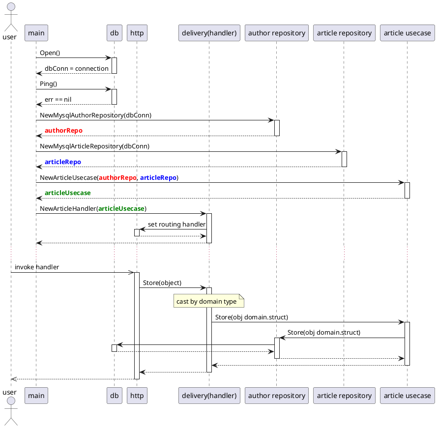

https://github.com/bxcodec/go-clean-arch

```text
+- article
|  +- delivery
|  |  +- http
|  |     +- article_handler.go
|  +- repository
|  |  +- mysql
|  |     +- mysql_article.go
|  +- usecase
|     + article_ucase.go
|
+- domain
   +- article.go ... Article struct, ArticleUsecase interface, ArticleRepository interface
   +- author.go ... Author struct, AuthorRepository
```



